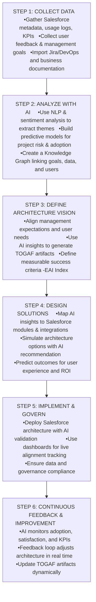

# AIAF (AI-Augmented Architecture Framework for Salesforce) with Expectation Alignment
Building AI course project

## Summary
AIAF enhances the traditional TOGAF method by embedding AI throughout the Salesforce project lifecycle and introducing an Expectation Alignment & Feedback Loop between management, architects, and end users.
This ensures that what’s designed, implemented, and delivered continuously adapts to evolving business expectations and user needs.

## Background
#### The Problem:
In Salesforce projects, management often envisions strategic outcomes (e.g., faster sales cycles, better customer insights), while end users (sales reps, service agents, marketers) need practical, easy-to-use workflows.
Misalignment between these two groups causes:
•	Rework, resistance, and low adoption
•	Delays in achieving ROI
•	“Delivered but not delighted” outcomes

#### How Common Is It?
Nearly every large Salesforce implementation faces expectation drift between executive goals and user experience.
#### Motivation:
To use AI as a mediator between business intent and user experience, continuously validating that what is being built serves both parties’ goals.
#### Why It’s Important:
Expectation alignment is the missing layer in most architecture frameworks. Solving it ensures both management and users perceive real, measurable value from the Salesforce platform.

## Data and AI Techniques
#### Data Sources:
-	Management inputs: Strategy decks, OKRs, KPIs, executive summaries
-	User feedback: Surveys, in-app feedback, support tickets, user session data
-	Salesforce usage analytics: Object interaction logs, field update frequencies, page load patterns
-	Change request history: From DevOps or Jira systems
#### AI Techniques:
- Natural Language Understanding (NLU): To interpret qualitative feedback and extract unmet expectations
- Sentiment Analysis: To detect frustration, satisfaction, or confusion among user groups
- Topic Modeling: To cluster recurring user complaints or feature requests
- AI-driven Traceability Mapping: To map business goals ↔ technical solutions ↔ user experience outcomes
- Predictive Analytics: To forecast adoption risk or expectation gaps

#### New Concept: “Expectation Alignment Index (EAI)”
A dynamic AI-generated score that measures how closely current Salesforce configurations and usage align with declared management goals and user satisfaction metrics.

## How It Is Used
Context:
The AIAF loop runs in parallel with TOGAF’s Architecture Development Method (ADM) phases -particularly influencing:
-	Phase B (Business Architecture): Align business intent and user realities through AI-summarized insights.
-	Phase E (Opportunities & Solutions): Simulate how proposed Salesforce changes will affect user experience and business KPIs.
-	Phase G (Implementation Governance): Continuously validate deliverables against management expectations and user outcomes.

#### Users & Stakeholders:
-	Executives: See expectation alignment dashboards highlighting where strategy execution is lagging.
-	Architects: Get AI-generated recommendations when design diverges from intended outcomes.
-	End Users: Provide natural language feedback that the system interprets and routes into architectural decisions.

## Challenges
-	Quality of Feedback: AI insights are only as good as the data users and managers provide.
-	Privacy: Collecting behavioral data requires transparent consent.
-	Overreliance on AI Metrics: Human validation remains essential for context and nuance.
-	Cultural Resistance: Teams must learn to value continuous feedback, not just project completion.

## What's Next
Future Enhancements:
-	Create a “Digital Twin of Expectations” -an AI model that continuously simulates alignment between management intent and user satisfaction.
-	Integrate adaptive UX reconfiguration -Salesforce UI elements that adjust based on AI-detected frustration or inefficiency.
-	Introduce AI moderation dashboards for project managers, where human and AI insights combine to resolve expectation mismatches early.
-	Standardize the Expectation Alignment Index as a governance metric within TOGAF-based methodologies.

## Acknowledgments
-	TOGAF and Salesforce Architecture Best Practices -foundational methodology references.
-	Elements of AI “AI Idea Gallery” - conceptual inspiration for embedding intelligence into organizational frameworks.
-	OpenAI models - for text and sentiment understanding, supporting automated feedback synthesis.
-	Salesforce Einstein & Tableau CRM - for AI-driven analytics and insight integration within Salesforce ecosystems.

